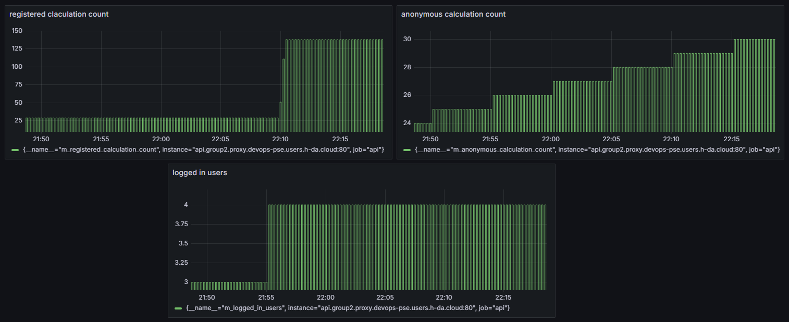
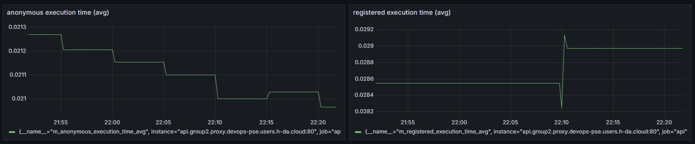
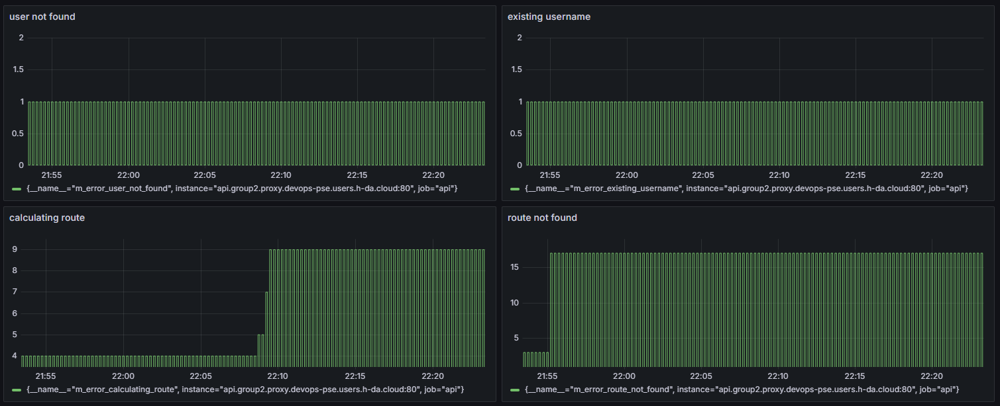
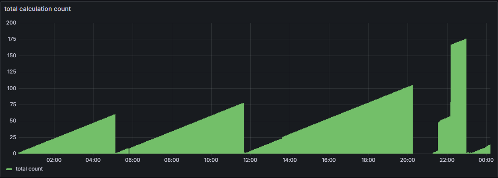

# Monitoring and Observability

This document provides an overview of metrics sent to Prometheus and visualized in Grafana.

---

## Table of Contents

1. [Prometheus Metrics](#prometheus-metrics)
2. [Grafana Dashboards](#grafana-dashboards)
   1. [Dashboard 1: Traffic Metrics](#dashboard-1-traffic-metrics)
   2. [Dashboard 2: Latency Metrics](#dashboard-2-latency-metrics)
   3. [Dashboard 3: Error Metrics](#dashboard-3-error-metrics)
   4. [Dashboard 4: Saturation Metrics](#dashboard-4-saturation-metrics)
3. [Operational Questions](#operational-questions)
   1. [Question 1](#question-1)
   2. [Question 2](#question-2)
   3. [Question 3](#question-3)
   4. [Question 4](#question-4)

---

## Prometheus Metrics

The application sends the following metrics to Prometheus for monitoring:

- traffic:
  - m_anonymous_calculated_route
  - m_logged_in_users
  - m_registered_calculated_route
- latency:
  - m_anonymous_avg_execution_time
  - m_registered_avg_execution_time
- error:
  - m_error_calculating_route
  - m_error_clearing_route_history
  - m_error_existing_username
  - m_error_missing_city
  - m_error_missing_username
  - m_error_route_not_found
  - m_error_user_not_found
- saturation:
  - m_concurrent_requests

---

## Grafana Dashboards

The Grafana dashboards provide insights into the application's performance and user interactions.

### Dashboard 1: Traffic Metrics

This dashboard visualizes the number of logged-in users and route calculations over time.

### Dashboard 2: Latency Metrics

This dashboard displays the average execution time for route calculations by anonymous and registered users.

### Dashboard 3: Error Metrics

This dashboard shows the number of errors encountered during route calculations and user interactions.

### Dashboard 4: Saturation Metrics

This dashboard tracks the number of concurrent requests to the application.

---

## Operational Questions

Following are exemplary questions, answered using the observations of Prometheus and Grafana:

### Question 1

`When did user X request a route from X to Y, and how long did the request take?`

First we look at the metrik for user-specific route calculations:
Here we can see, that `the user with id 9 requested the route from Markarth to Riften at 10:59:09pm on the 21st january 2025`.
As for how long the request took, we have to take a look at its execution time metric counterpart:

Now, that we can see the execution time, which is `0.02926...` seconds in this case, we can answer the question completely:

`The user with id 9 requested the route from Markarth to Riften at 10:59:09pm on the 21st january 2025 and the request ran ~0.029 seconds.`

### Question 2

`How many requests were made per day?`

This question is theoretically as easy as the last one. We just have to look at the Grafana panel, which `sums the anonymous and registered route-calculation count and takes the last/highest value of its interval-time-frame which is set to one day`. Sadly we are currently struggling to set the rules for the panel as just described. (The problem in this case is the time-interval-setting.)

For now we have a graph for the time frame of one day:

### Question 3

`What are the daily, weekly, and monthly active users (DAU/WAU/MAU)?`

Here, we have the same problem as mentioned in the question before: time-interval-setting.

for now, we can only show the `unfiltered logged in users count`:

As we can see there are `4 users logged` in.

### Question 4

`What is the average time taken for route calculations?`

Since we have _two different metrics for route calculations_(ananymous and registered) we will have to answer it for both respectively:

The average time for `anonymous route calculation`:

Since the application restarted a few times over the day, the precision may lack, but currently the average anonymous route calculation time is `0.021s`.

The average time for `registered route calculation`:

Since the application restarted a few times over the day, here too, the precision may lack, but currently the average registered route calculation time is `0.028s`.
